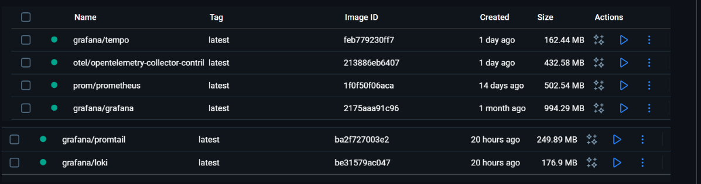
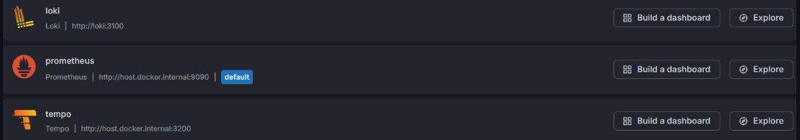

# open-telemetry
Simple grafana logs using Go.
```
                ┌──────────────┐
                │   Go App     │
                │ (your API)   │
                └──────┬───────┘
                       │
            ┌──────────┼──────────┐
            │          │          │
         metrics     traces      logs
            │          │          │
            ▼          ▼          ▼
    OTel Collector   Tempo   stdout/stderr
            │                     │
            ▼                     ▼
        Prometheus             Promtail
            │                     │
            └──────────┬──────────┘
                       ▼
                    Grafana
             
                
Go app			
  ↓ log.Printf()
Docker stdout
  ↓
Promtail
  ↓
Loki
  ↓
Grafana


Go App
  ├─ Traces → OTel Collector → Tempo
  ├─ Metrics → OTel Collector → Prometheus
  └─ Logs → stdout → Promtail → Loki
```

## 📋 Prerequisites
- **Go 1.23+**  
- **docker 4.5+**

## 🛠️ Installation
### 1. Clone the repository
```bash
git clone https://github.com/yogiehartanto/open-telemetry.git
cd open-telemetry
```

### 2. Docker file
```
put docker folder to C:
PS from C:\docker
docker compose up -d
docker should be run state
```



### 3. Run App
```
run main.go
```

### 4. Data Sources
```
go to http://localhost:3000/
find Connections - Data Sources - Add new data source
```

```
loki : http://loki:3100
prometheus : http://host.docker.internal:9090
tempo : http://host.docker.internal:3200

environment created
```

### 5. App Test
```
trigger :
curl api curl http://localhost:8080/user/list 
curl http://localhost:8080/order/list

go to http://localhost:3000/
find Logs
or go to http://localhost:3000/, find Data Sources
find Loki, click explore
on Label filters put container
pick value /grafana
logs will appear

Loki query example : 
{container="otel-demo-app"} | json | msg="api_called"
{container="otel-demo-app"} | json | trace_id="abcd1234"
{container="/grafana"} |= f8f765c0574462259b4cc1573defdfff |= /user/list |= statusCode=200
```
